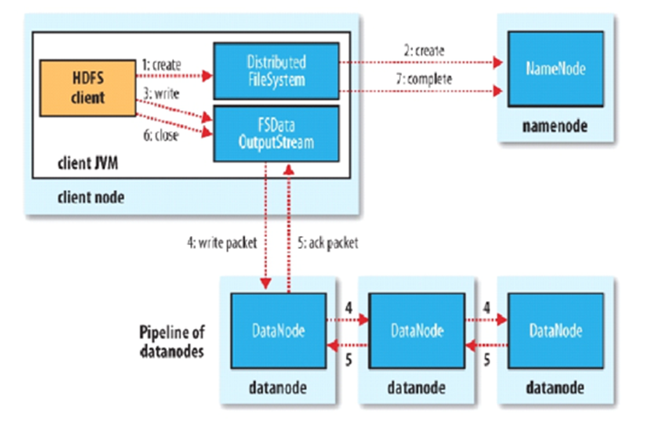
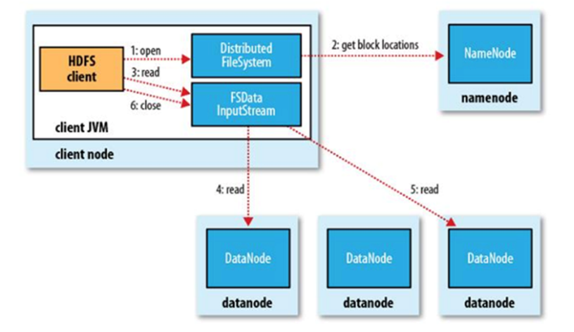
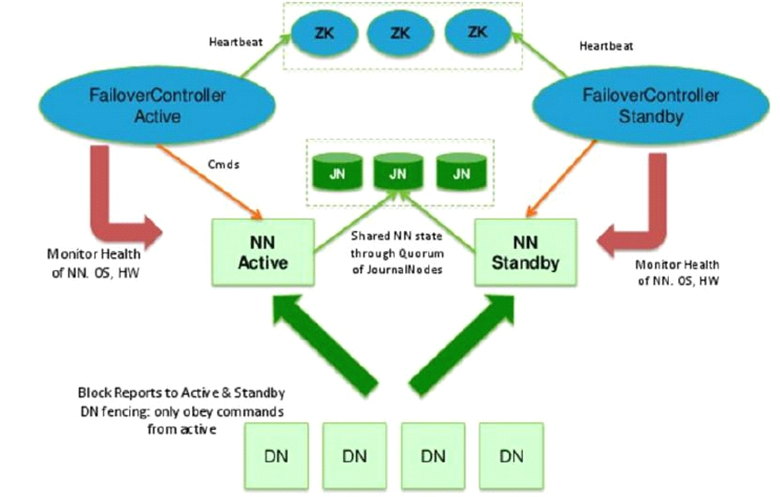
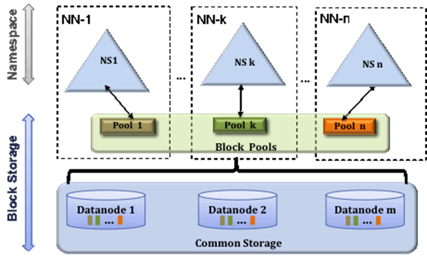

# HDFS

linux 一切皆文件
如：mount  /g  ->  disk:G分区 

角色即JVM进程

------


#### 理论知识点

**HDFS存储模型：**	
    	文件线性按字节切割成块(block)，具有offset，id。block的大小依据硬件的I/O特性调整，文件与文件的block大小可以不一样，除最后一个block，其他block大小一致 。block被分散存放在集群的节点中，具有location， Block具有副本(replication)，没有主从概念，副本不能出现在同一个节点。 文件上传可以指定block大小和副本数，上传后只能修改副本数。 一次写入多次读取，不支持修改，    支持追加数据

**架构设计**		
    HDFS是一个主从(Master/Slaves)架构， 由一个NameNode和一些DataNode组成 NN负责存储和管理文件元数据，并维护了一个层次型的文件目录树。 DN负责存储文件数据(block块)。 DataNode与NameNode维持心跳，并汇报块信息。 Client和NameNode交互文件元数据和DataNode交互文件block数据

​	在持久化的时候：文件属性会持久化，但是文件的每一个块不会持久化,恢复的时候，NN会丢失块的位置信息

**角色功能**
    NameNode：完全基于内存存储文件元数据、目录结构、文件block的映射
    需要持久化方案保证数据可靠性， 提供副本放置策略
    DataNode：基于本地磁盘存储block(文件的形式)，并保存block的校验和数据保证block的可靠性， 与NameNode保持心跳，汇报block列表状态

**元数据持久化**
    任何对文件系统元数据产生修改的操作，Namenode都会使用EditLog事务日志记录下来， 使用FsImage存储内存所有的元数据状态， 使用本地磁盘保存EditLog和FsImage。
    EditLog具有完整性，数据丢失少，但恢复速度慢，并有体积膨胀风险
    FsImage具有恢复速度快，体积与内存数据相当，但不能实时保存，数据丢失多
    NameNode使用  FsImage：镜像、快照  +   EditsLog：日志
    	滚动将增量的EditLog更新到FsImage，以保证更近时点的FsImage和更小的EditLog体积
	 滚动更新过程:最近时点的FsImage + 增量的EditsLog, NN ：第一次开机的时候，只写一次FI ，假设8点，到9点的时候，EL  记录的是8~9的日志
			只需要将8~9的日志的记录，更新到8点的FI中，FI的数据时点就变成了9点
			寻求另外一台机器来做


**安全模式**
    HDFS搭建时会格式化，格式化操作会产生一个空的FsImage，当Namenode启动时，它从硬盘中读取Editlog和FsImage，将所有Editlog中的事务作用在内存中的FsImage上，并将这个新版本的FsImage从内存中保存到本地磁盘上， 然后删除旧的Editlog
    Namenode启动后会进入一个称为安全模式的特殊状态。处于安全模式的Namenode是不会进行数据块的复制的。Namenode从所有的 Datanode接收心跳信号和块状态报告。每当Namenode检测确认某个数据块的副本数目达到这个最小值，那么该数据块就会被认为是副本安全(safely replicated)的。在一定百分比（参数可配置）的数据块被Namenode检测确认是安全之后（加上一个额外的30秒等待时间），Namenode将退出安全模式状态。接下来它会确定还有哪些数据块的副本没有达到指定数目，并将这些数据块复制到其他Datanode上

**Secondary NameNode（SNN）**
在非Ha模式下，SNN一般是独立的节点，周期完成对NN的EditLog向FsImage合并，减少EditLog大小，减少NN启动时间。根据配置文件设置的时间间隔fs.checkpoint.period  默认3600秒。根据配置文件设置edits log大小 fs.checkpoint.size 规定edits文件的最大值默认是64MB

**副本放置策略**

第一个副本：放置在上传文件的DN；如果是集群外提交，则随机挑选一台磁盘不太满，CPU不太忙的节点。
第二个副本：放置在于第一个副本不同的 机架的节点上。
第三个副本：与第二个副本相同机架的节点。
更多副本：随机节点。

**HDFS读写流程**
Client和NN连接创建文件元数据，NN判定元数据是否有效，处发副本放置策略，返回一个有序的DN列表，Client和DN建立Pipeline连接，Client将块切分成packet（64KB），并使用chunk（512B）+chucksum（4B）填充，Client将packet放入发送队列dataqueue中，并向第一个DN发送。第一个DN收到packet后本地保存并发送给第二个DN，第二个DN收到packet后本地保存并发送给第三个DN；这一个过程中，上游节点同时发送下一个packet。生活中类比工厂的流水线：结论：流式其实也是变种的并行计算





Hdfs使用这种传输方式，副本数对于client是透明的
当block传输完成，DN们各自向NN汇报，同时client继续传输下一个block
所以，client的传输和block的汇报也是并行的
为了降低整体的带宽消耗和读取延时，HDFS会尽量让读取程序读取离它最近的副本。如果在读取程序的同一个机架上有一个副本，那么就读取该副本。
如果一个HDFS集群跨越多个数据中心，那么客户端也将首先读本地数据中心的副本。


语义：下载一个文件：
Client和NN交互文件元数据获取fileBlockLocation
NN会按距离策略排序返回
Client尝试下载block并校验数据完整性
语义：下载一个文件其实是获取文件的所有的block元数据，那么子集获取某些block应该成立
Hdfs支持client给出文件的offset自定义连接哪些block的DN，自定义获取数据.这个是支持计算层的分治、并行计算的核心


------


## hadoop  安装：

centos 6.5/jdk 1.8 /hadoop 2.6.5  

- 基础设施
      操作系统、环境、网络、必须软件
          设置IP及主机名
          关闭防火墙&selinux
          设置hosts映射
          时间同步
          安装jdk
          设置SSH免秘钥


- 部署配置
       伪分布式：  在一个节点启动所有的角色： NN,DN,SNN
| **host** | **NN** | **SNN** | **DN** |
| -------- | ------ | ------- | ------ |
| node01   | *      | *       | *      |


​          配置文件: hadoop-env.sh,core-site.xml,hdfs-site.xml,slaves

- 初始化运行
      1.格式化
      2.启动角色进程

- 命令行使用

#### 1. 基础设施：	

设置网络,IP

vm编辑->虚拟网络编辑器->观察 NAT模式的地址 

```bash
	vi /etc/sysconfig/network-scripts/ifcfg-eth0
    DEVICE=eth0
    HWADDR=00:0C:29:42:15:C2
    TYPE=Ethernet
    ONBOOT=yes
    NM_CONTROLLED=yes
    BOOTPROTO=static
    IPADDR=192.168.150.11
    NETMASK=255.255.255.0
    GATEWAY=192.168.150.2
    DNS1=223.5.5.5
    DNS2=114.114.114.114
```

设置主机名

```bash
vi /etc/sysconfig/network
	NETWORKING=yes
	HOSTNAME=node01
```

设置本机的ip到主机名的映射关系

```bash
vi /etc/hosts
	192.168.150.11 node01
	192.168.150.12 node02
```

设置主机名

```bash
vi /etc/sysconfig/network
	NETWORKING=yes
	HOSTNAME=node01
```

设置本机的ip到主机名的映射关系

```bash
vi /etc/hosts
	192.168.150.11 node01
	192.168.150.12 node02
```

关闭防火墙
```bash
service iptables stop
chkconfig iptables off
```

关闭 selinux
```bash
vi /etc/selinux/config
	SELINUX=disabled
```

做时间同步

```bash
yum install ntp  -y
vi /etc/ntp.conf
	server ntp1.aliyun.com
	service ntpd start
	chkconfig ntpd on
```

###### **安装JDK：**

```bash
rpm -i  jdk-8u181-linux-x64.rpm	
vi /etc/profile     
	export  JAVA_HOME=/usr/java/default
	export PATH=$PATH:$JAVA_HOME/bin
source /etc/profile   |  ./etc/profile
```

###### **ssh免密：**  

ssh  localhost  验证自己是否免密 ,被动生成了  /root/.ssh
	如果A 想 免密的登陆到B：
		A：生成公钥，把公钥给B
			ssh-keygen -t dsa -P '' -f ~/.ssh/id_dsa
		B：
		cat ~/.ssh/id_dsa.pub >> ~/.ssh/authorized_keys

#### 2. Hadoop的配置（应用的搭建过程）


```bash
mkdir /opt/bigdata
tar xf hadoop-2.6.5.tar.gz
mv hadoop-2.6.5  /opt/bigdata/
pwd 	/opt/bigdata/hadoop-2.6.5

vi /etc/profile	
    export JAVA_HOME=/usr/java/default
    export HADOOP_HOME=/opt/bigdata/hadoop-2.6.5
    export PATH=$PATH:$JAVA_HOME/bin:$HADOOP_HOME/bin:$HADOOP_HOME/sbin
source /etc/profile

################ 配置hadoop的角色 ####################
cd  $HADOOP_HOME/etc/hadoop

##必须给hadoop配置javahome要不ssh过去找不到
vi hadoop-env.sh 
			export JAVA_HOME=/usr/java/default
			
##给出NN角色在哪里启动			
vi core-site.xml  
	    <property>
			<name>fs.defaultFS</name>
			<value>hdfs://node01:9000</value>
		</property>
		
###配置hdfs  副本数为1. 
vi hdfs-site.xml
        <property>
          <name>dfs.replication</name>
          <value>1</value>
        </property>
        <property>
          <name>dfs.namenode.name.dir</name>
          <value>/var/bigdata/hadoop/local/dfs/name</value>
        </property>
        <property>
          <name>dfs.datanode.data.dir</name>
          <value>/var/bigdata/hadoop/local/dfs/data</value>
        </property>
        <property>
          <name>dfs.namenode.secondary.http-address</name>
          <value>node01:50090</value>
        </property>
        <property>
          <name>dfs.namenode.checkpoint.dir</name>
          <value>/var/bigdata/hadoop/local/dfs/secondary</value>
        </property>

###配置DN这个角色再那里启动
vi slaves
	 node01
```


#### 3. 初始化&启动：

  ​	hdfs namenode -format  
  ​      创建目录,并初始化一个空的fsimage
  ​      VERSION  CID
  ​	

  ​	start-dfs.sh
  ​		第一次：datanode和secondary角色会初始化创建自己的数据目录
  ​	

  访问 http://node01:50070
  ​	修改windows： C:\Windows\System32\drivers\etc\hosts
  ​		192.168.150.11 node01
  ​		192.168.150.12 node02
  ​		192.168.150.13 node03
  ​		192.168.150.14 node04

#### 4.  简单使用：

```bash
hdfs dfs -mkdir /bigdata
hdfs dfs -mkdir  -p  /user/root	 

#####验证：
cd   /var/bigdata/hadoop/local/dfs/name/current
##    观察 editlog的id是不是再fsimage的后边
cd /var/bigdata/hadoop/local/dfs/secondary/current
##    SNN 只需要从NN拷贝最后时点的FSimage和增量的Editlog

hdfs dfs -put hadoop*.tar.gz  /user/root
cd  /var/bigdata/hadoop/local/dfs/data/current/BP-281147636-192.168.150.11-1560691854170/current/finalized/subdir0/subdir0
```


	for i in `seq 100000`;do  echo "hello hadoop $i"  >>  data.txt  ;done
	hdfs dfs -D dfs.blocksize=1048576  -put  data.txt 
	cd  /var/bigdata/hadoop/local/dfs/data/current/BP-281147636-192.168.150.11-1560691854170/current/finalized/subdir0/subdir0
	检查data.txt被切割的块，他们数据什么样子

-----------------------------------------------------------------------------------------

### HDFS-HA

HDFS解决方案：
单点故障：
	高可用方案：HA（High Available） 	多个NN，主备切换，主
压力过大，内存受限：
	联帮机制： Federation（元数据分片）	多个NN，管理不同的元数据



多台NN主备模式，Active和Standby状态
	Active对外提供服务
增加journalnode角色(>3台)，负责同步NN的editlog
	最终一致性
增加zkfc角色(与NN同台)，通过zookeeper集群协调NN的主从选举和切换
	事件回调机制
DN同时向NNs汇报block清单


###### HDFS- Federation:

NN的压力过大，内存受限问题:
元数据分治，复用DN存储
元数据访问隔离性
DN目录隔离block




##### 完全分布式：

​	基础环境
​	部署配置
​		1）角色在哪里启动
​			NN： core-site.xml:  fs.defaultFS  hdfs://node01:9000
​			DN:  slaves:  node01
​			SNN: hdfs-siet.xml:  dfs.namenode.secondary.http.address node01:50090
​		2) 角色启动时的细节配置：
​			dfs.namenode.name.dir  
​			dfs.datanode.data.dir
​	初始化&启动
​		格式化
​			Fsimage
​			VERSION
​		start-dfs.sh
​			加载我们的配置文件
​			通过ssh 免密的方式去启动相应的角色

伪分布式到完全分布式 (四节点)：角色重新规划

| **host** | **NN** | **SNN** | **DN** |
| :------- | ------ | ------- | ------ |
| node01   | *      |         |        |
| node02   |        | *       | *      |
| node03   |        |         | *      |
| node04   |        |         | *      |


	node01:
		stop-dfs.sh
	ssh 免密是为了什么 ：  启动start-dfs.sh：  在哪里启动，那台就要对别人公开自己的公钥
		
	node02~node04:
		rpm -i jdk....
	node01:
		scp /root/.ssh/id_dsa.pub  node02:/root/.ssh/node01.pub
		scp /root/.ssh/id_dsa.pub  node03:/root/.ssh/node01.pub
		scp /root/.ssh/id_dsa.pub  node04:/root/.ssh/node01.pub
	node02:
		cd ~/.ssh
		cat node01.pub >> authorized_keys
	node03:
		cd ~/.ssh
		cat node01.pub >> authorized_keys
	node04:
		cd ~/.ssh
		cat node01.pub >> authorized_keys

配置部署：

	 node01:
			cd $HADOOP/etc/hadoop
			vi core-site.xml    不需要改
			vi hdfs-site.xml
				    <property>
					<name>dfs.replication</name>
					<value>2</value>
				    </property>
				    <property>
					<name>dfs.namenode.name.dir</name>
					<value>/var/bigdata/hadoop/full/dfs/name</value>
				    </property>
				    <property>
					<name>dfs.datanode.data.dir</name>
					<value>/var/bigdata/hadoop/full/dfs/data</value>
				    </property>
				    <property>
					<name>dfs.namenode.secondary.http-address</name>
					<value>node02:50090</value>
				    </property>
				    <property>
					<name>dfs.namenode.checkpoint.dir</name>
					<value>/var/bigdata/hadoop/full/dfs/secondary</value>
				    </property>
			vi slaves
				node02
				node03
				node04
		分发：
			cd /opt
			scp -r ./bigdata/  node02:`pwd`
			scp -r ./bigdata/  node03:`pwd`
			scp -r ./bigdata/  node04:`pwd`
	
		格式化启动
			hdfs namenode -format
			start-dfs.sh

-----------------------------------------------------
----------------------------------------------------

FULL  ->  HA:
HA模式下：有一个问题，你的NN是2台？在某一时刻，谁是Active呢？client是只能连接Active

core-site.xml
fs.defaultFs -> hdfs://node01:9000


	配置：
		core-site.xml
			<property>
			  <name>fs.defaultFS</name>
			  <value>hdfs://mycluster</value>
			</property>
	<property>
		   <name>ha.zookeeper.quorum</name>
		   <value>node02:2181,node03:2181,node04:2181</value>
		 </property>
	
	hdfs-site.xml
		#以下是  一对多，逻辑到物理节点的映射
		<property>
		  <name>dfs.nameservices</name>
		  <value>mycluster</value>
		</property>
		<property>
		  <name>dfs.ha.namenodes.mycluster</name>
		  <value>nn1,nn2</value>
		</property>
		<property>
		  <name>dfs.namenode.rpc-address.mycluster.nn1</name>
		  <value>node01:8020</value>
		</property>
		<property>
		  <name>dfs.namenode.rpc-address.mycluster.nn2</name>
		  <value>node02:8020</value>
		</property>
		<property>
		  <name>dfs.namenode.http-address.mycluster.nn1</name>
		  <value>node01:50070</value>
		</property>
		<property>
		  <name>dfs.namenode.http-address.mycluster.nn2</name>
		  <value>node02:50070</value>
		</property>
	
		#以下是JN在哪里启动，数据存那个磁盘
		<property>
		  <name>dfs.namenode.shared.edits.dir</name>
		  <value>qjournal://node01:8485;node02:8485;node03:8485/mycluster</value>
		</property>
		<property>
		  <name>dfs.journalnode.edits.dir</name>
		  <value>/var/bigdata/hadoop/ha/dfs/jn</value>
		</property>
		
		#HA角色切换的代理类和实现方法，我们用的ssh免密
		<property>
		  <name>dfs.client.failover.proxy.provider.mycluster</name>
		  <value>org.apache.hadoop.hdfs.server.namenode.ha.ConfiguredFailoverProxyProvider</value>
		</property>
		<property>
		  <name>dfs.ha.fencing.methods</name>
		  <value>sshfence</value>
		</property>
		<property>
		  <name>dfs.ha.fencing.ssh.private-key-files</name>
		  <value>/root/.ssh/id_dsa</value>
		</property>
		
		#开启自动化： 启动zkfc
		 <property>
		   <name>dfs.ha.automatic-failover.enabled</name>
		   <value>true</value>
		 </property>


	1. 基础设施
		ssh免密：
			1）启动start-dfs.sh脚本的机器需要将公钥分发给别的节点
			2）在HA模式下，每一个NN身边会启动ZKFC，
				ZKFC会用免密的方式控制自己和其他NN节点的NN状态
	2应用搭建
		HA 依赖 ZK  搭建ZK集群
		修改hadoop的配置文件，并集群同步
	3初始化启动
		1）先启动JN   hadoop-daemon.sh start journalnode 
		2）选择一个NN 做格式化：hdfs namenode -format   <只有第一次搭建做，以后不用做>
		3)启动这个格式化的NN ，以备另外一台同步  hadoop-daemon.sh start namenode 
		4)在另外一台机器中： hdfs namenode -bootstrapStandby
		5)格式化zk：   hdfs zkfc  -formatZK     <只有第一次搭建做，以后不用做>
		6) start-dfs.sh
	使用

------实操：

```bash
	1）停止之前的集群
	2）免密：node01,node02
		node02: 
			cd ~/.ssh
			ssh-keygen -t dsa -P '' -f ./id_dsa
			cat id_dsa.pub >> authorized_keys
			scp ./id_dsa.pub  node01:`pwd`/node02.pub
		node01:
			cd ~/.ssh
			cat node02.pub >> authorized_keys
	3)zookeeper 集群搭建  java语言开发  需要jdk  部署在2,3,4
		node02:
			tar xf zook....tar.gz
			mv zoo...    /opt/bigdata
			cd /opt/bigdata/zoo....
			cd conf
			cp zoo_sample.cfg  zoo.cfg
			vi zoo.cfg
				datadir=/var/bigdata/hadoop/zk
				server.1=node02:2888:3888
				server.2=node03:2888:3888
				server.3=node04:2888:3888
			mkdir /var/bigdata/hadoop/zk
echo 1 >  /var/bigdata/hadoop/zk/myid 
vi /etc/profile
export ZOOKEEPER_HOME=/opt/bigdata/zookeeper-3.4.6
export PATH=$PATH:$JAVA_HOME/bin:$HADOOP_HOME/bin:$HADOOP_HOME/sbin:$ZOOKEEPER_HOME/bin
	. /etc/profile
			cd /opt/bigdata
			scp -r ./zookeeper-3.4.6  node03:`pwd`
			scp -r ./zookeeper-3.4.6  node04:`pwd`
		node03:
			mkdir /var/bigdata/hadoop/zk
			echo 2 >  /var/bigdata/hadoop/zk/myid
			*环境变量
			. /etc/profile
		node04:
			mkdir /var/bigdata/hadoop/zk
			echo 3 >  /var/bigdata/hadoop/zk/myid
			*环境变量
			. /etc/profile
node02~node04:
		zkServer.sh start

4）配置hadoop的core和hdfs
5）分发配置
	给每一台都分发
6）初始化：
	1）先启动JN   hadoop-daemon.sh start journalnode 
	2）选择一个NN 做格式化：hdfs namenode -format   <只有第一次搭建做，以后不用做>
	3)启动这个格式化的NN ，以备另外一台同步  hadoop-daemon.sh start namenode 
	4)在另外一台机器中： hdfs namenode -bootstrapStandby
	5)格式化zk：   hdfs zkfc  -formatZK     <只有第一次搭建做，以后不用做>
	6) start-dfs.sh	
```
使用验证：
	1）去看jn的日志和目录变化：
	2）node04
		zkCli.sh 
			ls /
			启动之后可以看到锁：
			get  /hadoop-ha/mycluster/ActiveStandbyElectorLock
	3）杀死namenode 杀死zkfc
		kill -9  xxx
		a)杀死active NN
		b)杀死active NN身边的zkfc
		c)shutdown activeNN 主机的网卡 ： ifconfig eth0 down
			2节点一直阻塞降级
			如果恢复1上的网卡   ifconfig eth0 up  
			最终 2编程active


==================================================================================

1，hdfs 的权限

hdfs是一个文件系统,有用户概念;默认情况使用操作系统提供的用户,自己不创建用户
	linux系统中超级用户：root
	hdfs系统中超级用户： 是namenode进程的启动用户
有权限概念
	hdfs的权限是自己控制的 来自于hdfs的超级用户	


	切换我们用root搭建的HDFS  用god这个用户来启动
	node01~node04:
		 stop-dfs.sh
		1)添加用户：root
			useradd god
			passwd god
		2）讲资源与用户绑定（a,安装部署程序；b,数据存放的目录）
			chown -R god  src
			chown -R god /opt/bigdata/hadoop-2.6.5
			chown -R god /var/bigdata/hadoop
		3）切换到god去启动  start-dfs.sh  < 需要免密
			给god做免密
			*我们是HA模式：免密的2中场景都要做的
			ssh localhost   >> 为了拿到.ssh
			node01~node02:
				cd /home/god/.ssh
				ssh-keygen -t dsa -P '' -f  ./id_dsa
			node01:
				ssh-copy-id -i id_dsa node01
				ssh-copy-id -i id_dsa node02
				ssh-copy-id -i id_dsa node03
				ssh-copy-id -i id_dsa node04
			node02
				cd /home/god/.ssh
				ssh-copy-id -i id_dsa node01
				ssh-copy-id -i id_dsa node02
		4)hdfs-site.xml
			<property>
			  <name>dfs.ha.fencing.ssh.private-key-files</name>
			  <value>/home/god/.ssh/id_dsa</value>
			</property>
	
			分发给node02~04
		5)god  :  start-dfs.sh

----------用户权限验证实操：
	node01:
		su god
		hdfs dfs -mkdir   /temp
		hdfs dfs -chown god:ooxx  /temp
		hdfs dfs -chmod 770 /temp
	node04:
		root:
			useradd good
			groupadd ooxx
			usermod -a -G ooxx good
			id good
		su good
			hdfs dfs -mkdir /temp/abc  <失败
			hdfs groups 
				good:        <因为hdfs已经启动了，不知道你操作系统又偷偷摸摸创建了用户和组
	*node01:
		root:
			useradd good
			groupadd ooxx
			usermod -a -G ooxx good
		su god 
			hdfs dfsadmin -refreshUserToGroupsMappings
	node04:
		good:
			hdfs groups 
				good : good ooxx

	结论：默认hdfs依赖操作系统上的用户和组


-------------------hdfs api 实操：

windows idea eclips  叫什么：  集成开发环境  ide 你不需要做太多，用它~！！！

	语义：开发hdfs的client
	权限：1）参考系统登录用户名；2）参考环境变量；3）代码中给出；
	HADOOP_USER_NAME  god
		这一步操作优先启动idea
	jdk版本：集群和开发环境jdk版本一致~！！
	
	maven：构建工具  
		包含了依赖管理（pom）
		jar包有仓库的概念，互联网仓库全，大
			本地仓库，用过的会缓存
		打包、测试、清除、构建项目目录。。。。
		GAV定位。。。。
		https://mvnrepository.com/
	
	hdfs的pom：
		hadoop：（common，hdfs，yarn，mapreduce）


==================================================================================

3，mapreduce 启蒙

mapreduce：批量计算     流式计算 
	计算模型
		2阶段：map和reduce是一种阻塞关系
		map阶段
			单条记录加工和处理
		reduc阶段
			按组，多条记录加工处理
	实现： ->  框架
		计算向数据移动：
			hdfs暴露数据的位置
			1）资源管理
			2）任务调度
		角色：
			JobTracker
				1，资源管理
				2，任务调度
			TaskTracker
				任务管理
				资源汇报
			【Cli  ？】
				1，会根据每次的计算数据，咨询NN元数据（block）=》算：split 得到一个切片的【清单】
					map的数量就有了
					split是逻辑的，block是物理的，block身上有（offset，locations），split和block是有映射关系
						结果：split包含偏移量，以及split对应的map任务应该移动到哪些节点（locations）
						split01  A  0  500  n1 n3 n5
					可以支持计算向数据移动了~！！！
				2，生成计算程序未来运行时的相关【配置的文件】：  。。。。xml
				3，未来的移动应该相对可靠
					cli会讲 jar，split清单，配置xml  上传到hdfs的目录中（上传的数据，副本数10）
				4，cli会调用JobTracker，通知要启动一个计算程序了，并且告知文件都放在了hdfs的哪些地方


				JobTracker收到启动程序之后：
					1，从hdfs中取回 【split清单】
					2，根据自己收到的TT汇报的资源，最终确定每一个split对应的map应该去到哪一个节点，【确定清单】
					3，未来，TT再心跳的时候会取回分配给自己的任务信息~！

​				TaskTracker
​					1，在心跳取回任务后
​					2，从hdfs中下载 jar，xml。。到本机
​					3，最终启动任务描述中的MapTask/ReduceTask  （最终，代码在某一个节点被启动，是通过，cli上传，TT下载：计算向数据移动的实现~！）
​			
​				问题：
​					JobTracker 3个问题：
​						1，单点故障
​						2，压力过大
​						3，集成了【资源管理和任务调度】，两者耦合
​							弊端：未来新的计算框架不能复用资源管理
​								1，重复造轮子
​								2，因为各自实现资源管理，但是他们部署在同一批硬件上，因为隔离，所以不能感知对方的使用
​									so：资源争抢~！！！


				思路：（因果关系导向学习）
					【计算要向数据移动】
						->哪些节点可以去呢（需要有整体资源的把控）
							->确定了节点后对方怎么知道呢（任务调度），还有比如有一个失败了，应该重新在哪个节点重试
								->来个JobTracker搞定了这2件事情。。。但是，后来，问题也暴露了。。。。
												
	hadoop2.x  yarn
		模型：
			container容器 不是docker
				虚的
					对象：属性：NM，cpu，mem，io量
				物理的
					JVM ->操作系统进程 
					1，NM会有线程监控container资源情况，超额，NM 直接kill掉
					2，cgroup内核级技术：在启动jvm进程，由kernel约束死
					*整合docker
		实现：架构/框架
			ResourceManager  主
				负责整体资源的管理
			NodeManager 从
				向RS汇报心跳，提交自己的资源情况


​		  
​		MR运行 MapReduce on yarn
​			1，MR-cli（切片清单/配置/jar/上传到HDFS）
​				访问RM申请AppMaster
​			2，RM选择一台不忙的节点通知NM启动一个Container，在里面反射一个MRAppMaster
​			3，启动MRAppMaster，从hdfs下载切片清单，向RM申请资源
​			4，由RM根据自己掌握的资源情况得到一个确定清单，通知NM来启动container
​			5，container启动后会反向注册到已经启动的MRAppMaster进程
​			6，MRAppMaster（曾经的JobTracker阉割版不带资源管理）最终将任务Task发送给container（消息）
​			7，container会反射相应的Task类为对象，调用方法执行，其结果就是我们的业务逻辑代码的执行
​			8，计算框架都有Task失败重试的机制
​			
​			结论：
​				问题：
​					
​					1，单点故障（曾经是全局的，JT挂了，整个计算层没有了调度）
​						yarn：每一个APP由一个自己的AppMaster调度！（计算程序级别）
​						yarn支持AppMaster失败重试~！
​					2，压力过大
​						yarn中每个计算程序自有AppMaster，每个AppMaster只负责自己计算程序的任务调度，轻量了
​						AppMasters是在不同的节点中启动的，默认有了负载的光环
​					3，集成了【资源管理和任务调度】，两者耦合
​						因为Yarn只是资源管理，不负责具体的任务调度
​						是公立的，只要计算框架继承yarn的AppMaster，大家都可以使用一个统一视图的资源层~！！！


		总结感悟：
			从1.x到2.x
				JT，TT是MR的常服务。。。
			2.x之后没有了这些服务
				相对的：MR的cli，【调度】，任务，这些都是临时服务了。。。。


===================================================================


1，最终去开发MR计算程序
	*,HDFS和YARN  是俩概念  
2，hadoop2.x  出现了一个yarn ： 资源管理  》  MR  没有后台常服务
	yarn模型：container  容器，里面会运行我们的AppMaster ，map/reduce Task
		解耦
		mapreduce on yarn
	架构：
		RM
		NM
	搭建：
			   NN	NN	JN	ZKFC	ZK	DN	RM	NM
		node01	    *		*	*
		node02		*	*	*	*	 *		*
		node03			*		*	 *	 *	*
		node04					*	 *	 *	*
	
	hadoop	1.x		2.x			3.x
	hdfs:	no ha		ha(向前兼容，没有过多的改NN，二是通过新增了角色 zkfc)
	yarn	no yarn		yarn  （不是新增角色，二是直接在RM进程中增加了HA的模块）


-----通过官网：
	mapred-site.xml  >  mapreduce on yarn 
		    <property>
			<name>mapreduce.framework.name</name>
			<value>yarn</value>
		    </property>
	yarn-site.xml
	//shuffle  洗牌  M  -shuffle>  R
		    <property>
			<name>yarn.nodemanager.aux-services</name>
			<value>mapreduce_shuffle</value>
		    </property>

		 <property>
		   <name>yarn.resourcemanager.ha.enabled</name>
		   <value>true</value>
		 </property>
		 <property>
		   <name>yarn.resourcemanager.zk-address</name>
		   <value>node02:2181,node03:2181,node04:2181</value>
		 </property>
	
		 <property>
		   <name>yarn.resourcemanager.cluster-id</name>
		   <value>citiGroup</value>
		 </property>
	
		 <property>
		   <name>yarn.resourcemanager.ha.rm-ids</name>
		   <value>rm1,rm2</value>
		 </property>
		 <property>
		   <name>yarn.resourcemanager.hostname.rm1</name>
		   <value>node03</value>
		 </property>
		 <property>
		   <name>yarn.resourcemanager.hostname.rm2</name>
		   <value>node04</value>
		 </property>


	流程：
	我hdfs等所有的都用root来操作的
		node01：
			cd $HADOOP_HOME/etc/hadoop
			cp mapred-site.xml.template   mapred-site.xml	
			vi mapred-site.xml
			vi yarn-site.xml
			scp mapred-site.xml yarn-site.xml    node02:`pwd`
			scp mapred-site.xml yarn-site.xml    node03:`pwd`
			scp mapred-site.xml yarn-site.xml    node04:`pwd`
			vi slaves  //可以不用管，搭建hdfs时候已经改过了。。。
			start-yarn.sh
			    zkCli.sh  
			    ls / 
			    get /yarn-leader-election/mashibing/ActiveStandbyElectorLock
		node03~04:
			yarn-daemon.sh start resourcemanager
		http://node03:8088
		http://node04:8088
			This is standby RM. Redirecting to the current active RM: http://node03:8088/

-------MR 官方案例使用：wc
	实战：MR ON YARN 的运行方式：
		hdfs dfs -mkdir -p   /data/wc/input
		hdfs dfs -D dfs.blocksize=1048576  -put data.txt  /data/wc/input
		hdfs dfs -ls /data/wc/output
		cd  $HADOOP_HOME
		cd share/hadoop/mapreduce
		hadoop jar  hadoop-mapreduce-examples-2.6.5.jar   wordcount   /data/wc/input   /data/wc/output
			1)webui:
			2)cli:
		hdfs dfs -ls /data/wc/output
			-rw-r--r--   2 root supergroup          0 2019-06-22 11:37 /data/wc/output/_SUCCESS  //标志成功的文件
			-rw-r--r--   2 root supergroup     788922 2019-06-22 11:37 /data/wc/output/part-r-00000  //数据文件
				part-r-00000
				part-m-00000
					r/m :  map+reduce   r   / map  m
		hdfs dfs -cat  /data/wc/output/part-r-00000
		hdfs dfs -get  /data/wc/output/part-r-00000  ./

=====================================================================
MR  提交方式
源码

提交方式：
	1，开发-> jar  -> 上传到集群中的某一个节点 -> hadoop jar  ooxx.jar  ooxx  in out
	2，嵌入【linux，windows】（非hadoop jar）的集群方式  on yarn
		集群：M、R
		client -> RM -> AppMaster
		mapreduce.framework.name -> yarn   //决定了集群运行
		conf.set("mapreduce.app-submission.cross-platform","true");
		job.setJar("C:\\Users\\Administrator\\IdeaProjects\\msbhadoop\\target\\hadoop-hdfs-1.0-0.1.jar");
			//^推送jar包到hdfs
	3，local，单机  自测
		mapreduce.framework.name -> local
		conf.set("mapreduce.app-submission.cross-platform","true"); //windows上必须配
				1，在win的系统中部署我们的hadoop：
					C:\usr\hadoop-2.6.5\hadoop-2.6.5
				2，在我给你的资料中\hadoop-install\soft\bin  文件覆盖到 你部署的bin目录下
					还要将hadoop.dll  复制到  c:\windwos\system32\
				3，设置环境变量：HADOOP_HOME  C:\usr\hadoop-2.6.5\hadoop-2.6.5 
	


参数个性化：
	GenericOptionsParser parser = new GenericOptionsParser(conf, args);  //工具类帮我们把-D 等等的属性直接set到conf，会留下commandOptions
        String[] othargs = parser.getRemainingArgs();

-----------------------------------------------------------------
##### 源码的分析：

  更好的理解你学的技术的细节 以及原理
	资源层yarn

​	Client
​		1，Checking the input and output specifications of the job.
​		2，Computing the InputSplits for the job.  // split  ->并行度和计算向数据移动就可以实现了
​		3，Setup the requisite accounting information for the DistributedCache of the job, if necessary.
​		4，Copying the job's jar and configuration to the map-reduce system directory on the distributed file-system.
​		5，Submitting the job to the JobTracker and optionally monitoring it's status
​		

		MR框架默认的输入格式化类： TextInputFormat < FileInputFormat < InputFormat
								getSplits()			    
			
			minSize = 1
			maxSize = Long.Max
			blockSize = file
			splitSize = Math.max(minSize, Math.min(maxSize, blockSize));  //默认split大小等于block大小
				切片split是一个窗口机制：（调大split改小，调小split改大）
					如果我想得到一个比block大的split：
	
			if ((blkLocations[i].getOffset() <= offset < blkLocations[i].getOffset() + blkLocations[i].getLength()))
			split：解耦 存储层和计算层
				1，file
				2，offset
				3，length
				4，hosts    //支撑的计算向数据移动
	
	MapTask
		input ->  map  -> output
		input:(split+format)  通用的知识，未来的spark底层也是
			来自于我们的输入格式化类给我们实际返回的记录读取器对象
				TextInputFormat->LineRecordreader
							split: file , offset , length
							init():
								in = fs.open(file).seek(offset)
								除了第一个切片对应的map，之后的map都在init环节，
								从切片包含的数据中，让出第一行，并把切片的起始更新为切片的第二行。
								换言之，前一个map会多读取一行，来弥补hdfs把数据切割的问题~！
							nextKeyValue():
								1，读取数据中的一条记录对key，value赋值
								2，返回布尔值
							getCurrentKey():
							getCurrentValue():


		output：
			NewOutputCollector
				partitioner
				collector
					MapOutputBuffer:
						*：
							map输出的KV会序列化成字节数组，算出P，最中是3元组：K,V,P
							buffer是使用的环形缓冲区：
								1，本质还是线性字节数组
								2，赤道，两端方向放KV,索引
								3，索引：是固定宽度：16B：4个int
									a)P
									b)KS
									c)VS
									d)VL
								5,如果数据填充到阈值：80%，启动线程：
									快速排序80%数据，同时map输出的线程向剩余的空间写
									快速排序的过程：是比较key排序，但是移动的是索引
								6，最终，溢写时只要按照排序的索引，卸下的文件中的数据就是有序的
									注意：排序是二次排序（索引里有P，排序先比较索引的P决定顺序，然后在比较相同P中的Key的顺序）
										分区有序  ： 最后reduce拉取是按照分区的
										分区内key有序： 因为reduce计算是按分组计算，分组的语义（相同的key排在了一起）
								7，调优：combiner
									1，其实就是一个map里的reduce
										按组统计
									2，发生在哪个时间点：
										a)内存溢写数据之前排序之后
											溢写的io变少~！
										b)最终map输出结束，过程中，buffer溢写出多个小文件（内部有序）
											minSpillsForCombine = 3
											map最终会把溢写出来的小文件合并成一个大文件：
												避免小文件的碎片化对未来reduce拉取数据造成的随机读写
											也会触发combine
									3，combine注意
										必须幂等
										例子：
											1，求和计算
											1，平均数计算
												80：数值和，个数和
						init():
							spillper = 0.8
							sortmb = 100M
							sorter = QuickSort
							comparator = job.getOutputKeyComparator();
										1，优先取用户覆盖的自定义排序比较器
										2，保底，取key这个类型自身的比较器
							combiner ？reduce
								minSpillsForCombine = 3
	
							SpillThread
								sortAndSpill()
									if (combinerRunner == null)


